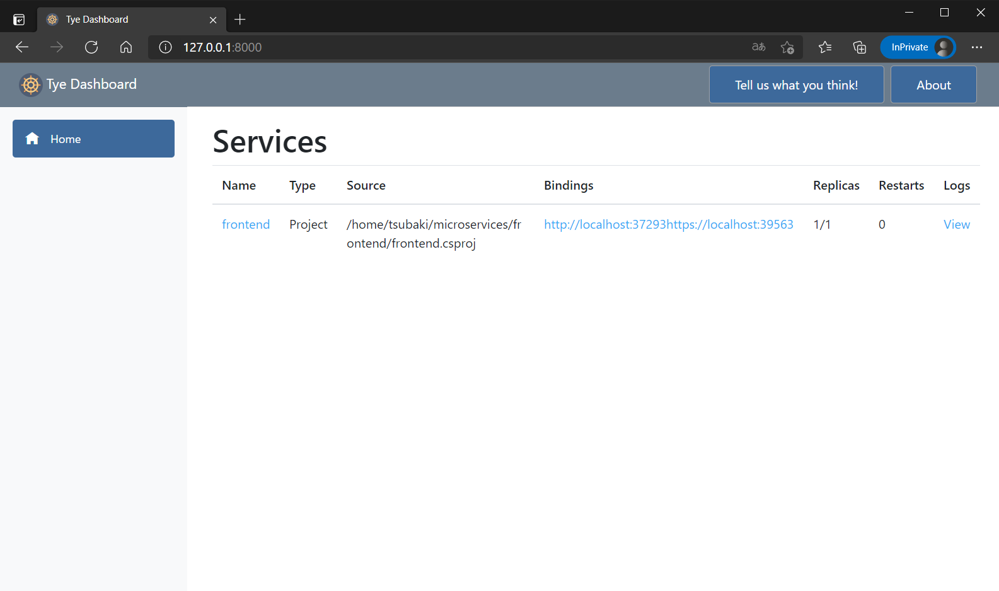
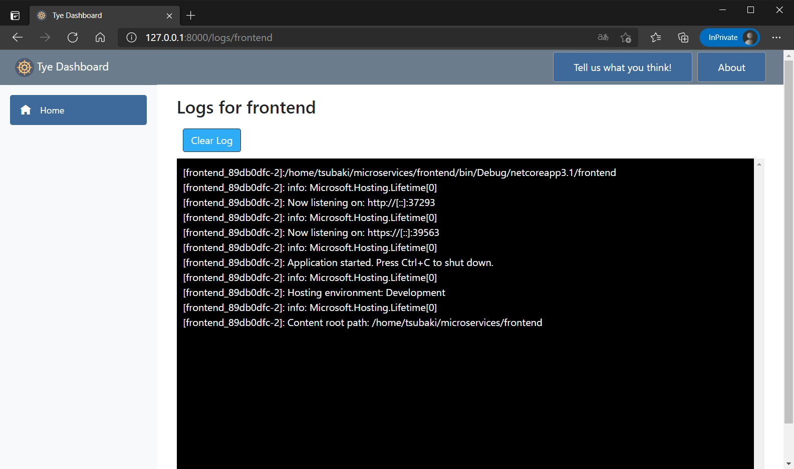
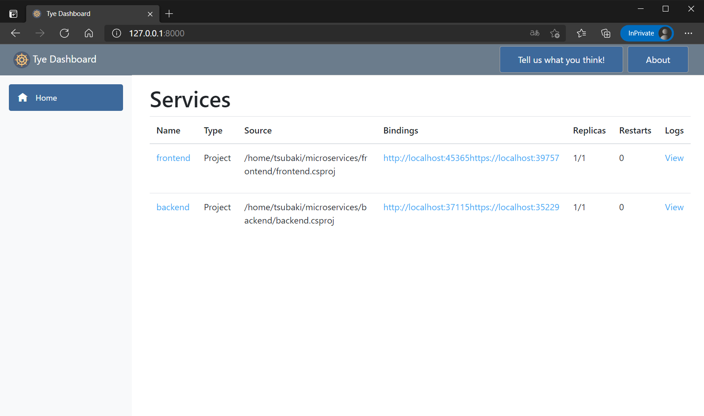
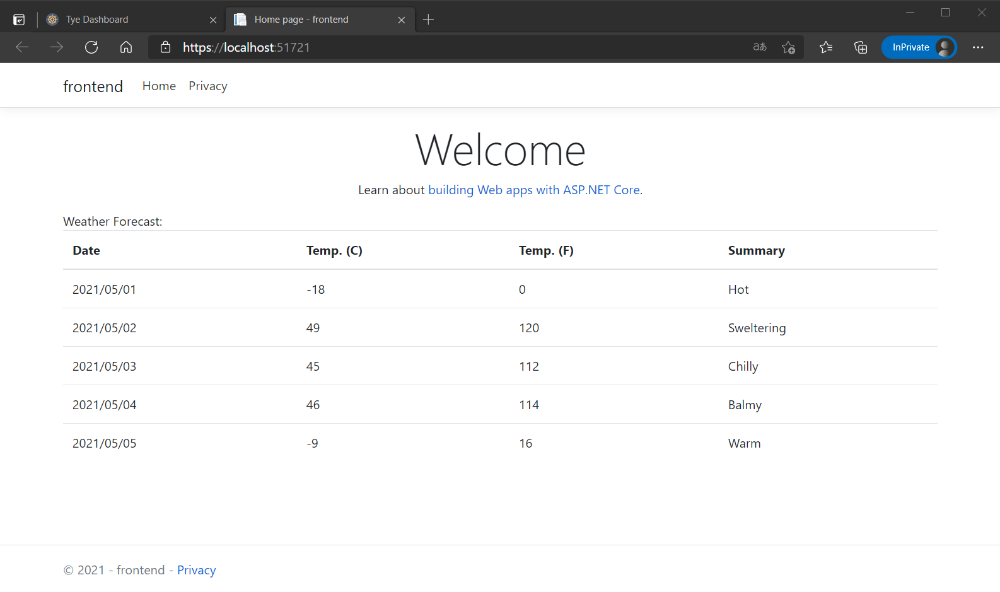

# 基本的な動作を試してみよう

まずはサンプルアプリケーションを作って Tye を試してみましょう。

## フロントエンドアプリケーションの作成

まずフロントエンドのアプリケーションとして、 ASP.NET Core Razor Pages のプロジェクトを作成します。

```
mkdir microservices
cd microservices
dotnet new razor -n frontend
```

## Tye の実行

フロントエンドアプリケーションに対して Tye を実行します。

```
tye run frontend
```

`tye run` コマンドでは、指定したアプリケーションの実行が行われます。
その際に Tye のダッシュボードも同時に実行されるため、 `http://127.0.0.1:8000` にアクセスするとフロントエンドのアプリケーションがサービスとして登録されていることがわかります。




表の `Bindings` 列に表示されているのがフロントエンドアプリケーションにアクセスするためのURLです。  
アクセスすると、実際にアプリケーションを閲覧することができます。


表の `Logs` 列の `View` にて、アプリケーションのログを閲覧することもできます。  
ここで表示されるログは標準出力に流れるログです。



`Ctrl` + `c` で Tye の実行を止めます。

## バックエンドアプリケーションの作成

次にバックエンドサービスとして ASP.NET Core Web API のアプリケーションとソリューションファイルを作成します。

```
dotnet new webapi -n backend
dotnet new sln
dotnet sln add frontend backend
```

## Tye の実行

作成したソリューションファイルに対して Tye を実行してみましょう。  
ソリューションファイルに含まれるフロントエンドとバックエンドのアプリケーションが起動します。

```
tye run
```

ダッシュボードにも2つのサービスが登録されていることを確認します。



`Ctrl` + `c` で Tye の実行を止めます。

## フロントエンドからバックエンドサービスを呼び出す

フロントエンドからバックエンドサービスを呼び出し、 API が返すデータを画面に表示するようにコードを変更します。  
Visual Studio Code で `microservices` フォルダを開きます。

### ファイルの追加

`frontend` プロジェクトに 2つの C# ファイルを追加します。

#### `WeatherForecast.cs`

```csharp
using System;

namespace frontend
{
    public class WeatherForecast
    {
        public DateTime Date { get; set; }

        public int TemperatureC { get; set; }

        public int TemperatureF => 32 + (int)(TemperatureC / 0.5556);

        public string Summary { get; set; }
    }
}
```

#### `WeatherClient.cs`

```csharp
using System.Net.Http;
using System.Text.Json;
using System.Threading.Tasks;

namespace frontend
{
    public class WeatherClient
    {
        private readonly JsonSerializerOptions options = new JsonSerializerOptions()
        {
            PropertyNameCaseInsensitive = true,
            PropertyNamingPolicy = JsonNamingPolicy.CamelCase,
        };

        private readonly HttpClient client;

        public WeatherClient(HttpClient client)
        {
            this.client = client;
        }

        public async Task<WeatherForecast[]> GetWeatherAsync()
        {
            var responseMessage = await this.client.GetAsync("/weatherforecast");
            var stream = await responseMessage.Content.ReadAsStreamAsync();
            return await JsonSerializer.DeserializeAsync<WeatherForecast[]>(stream, options);
        }
    }
}
```

### 拡張機能のインストール

`frontend` プロジェクトに `Microsoft.Tye.Extensions.Configuration` というパッケージを追加します。  
https://www.nuget.org/packages/Microsoft.Tye.Extensions.Configuration/

```
dotnet add frontend/frontend.csproj package Microsoft.Tye.Extensions.Configuration --version 0.6.0-*
```

### バックエンドサービスの HTTP クライアントの登録

`frontend/Startup.cs` を開き、 `ConfigureServices` メソッドに以下を追加する。  
これによりフロントエンドアプリケーションからバックエンドサービスに通信するための HTTP クライアントを登録することができます。

```csharp
public void ConfigureServices(IServiceCollection services)
{
    services.AddRazorPages();

    // ここから追加
    services.AddHttpClient<WeatherClient>(client =>
    {
        client.BaseAddress = Configuration.GetServiceUri("backend");
    });
    // ここまで追加
}
```

`GetServiceUri` メソッドが拡張機能によって利用可能となり、指定した名前のサービスの URI を取得することができます。  
https://github.com/dotnet/tye/blob/083a97f353069ef8a091651d4c9ca445c994b2e5/src/Microsoft.Tye.Extensions.Configuration/TyeConfigurationExtensions.cs#L11

### バックエンドサービスのデータの表示

`frontend/Pages/Index.cshtml.cs` を開き、 `WeatherForecast` クラスをプロパティに定義します。

```csharp
public WeatherForecast[] Forecasts { get; set; }
```

また、同じファイルの `OnGet` メソッドを以下のように変更します。

```csharp
public async Task OnGet([FromServices]WeatherClient client)
{
    Forecasts = await client.GetWeatherAsync();
}
```

`frontend/Pages/Index.cshtml` を開き、 `Forecasts` プロパティを表示するように変更します。

```cshtml
@page
@model IndexModel
@{
    ViewData["Title"] = "Home page";
}

<div class="text-center">
    <h1 class="display-4">Welcome</h1>
    <p>Learn about <a href="https://docs.microsoft.com/aspnet/core">building Web apps with ASP.NET Core</a>.</p>
</div>

Weather Forecast:

<table class="table">
    <thead>
        <tr>
            <th>Date</th>
            <th>Temp. (C)</th>
            <th>Temp. (F)</th>
            <th>Summary</th>
        </tr>
    </thead>
    <tbody>
        @foreach (var forecast in @Model.Forecasts)
        {
            <tr>
                <td>@forecast.Date.ToShortDateString()</td>
                <td>@forecast.TemperatureC</td>
                <td>@forecast.TemperatureF</td>
                <td>@forecast.Summary</td>
            </tr>
        }
    </tbody>
</table>
```

## Tye の実行

一通りの実装を終えたら再び Tye を実行します。  
フロントエンドアプリケーションにアクセスすると、バックエンドサービスが返すデータが表示されることを確認しましょう。


