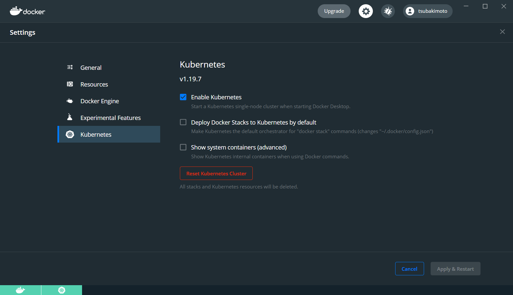
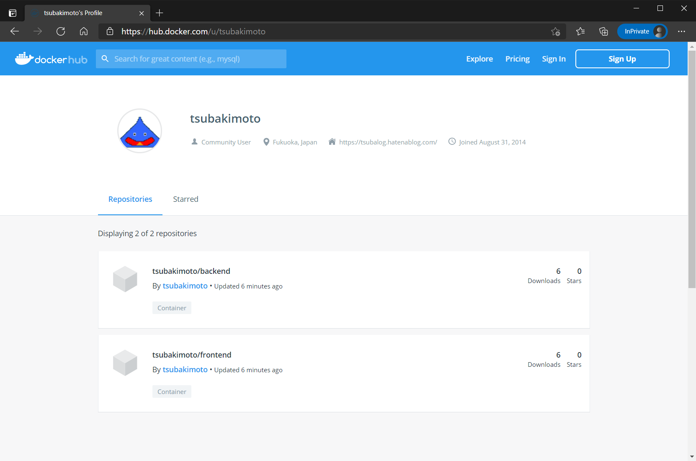
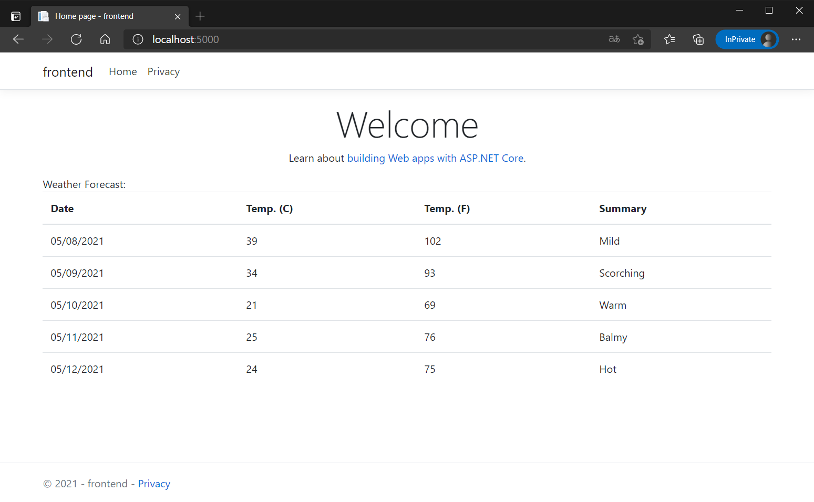

# Kubernetes にデプロイする

[Basic](../Basic/README.md) で作成したサンプルアプリケーションを Kubernetes にデプロイしてみましょう。

## セットアップ

今回は Docker Desktop に含まれる Kubernetes を使用します。  
[ドキュメント](https://docs.docker.com/desktop/kubernetes/#enable-kubernetes)に従って、 Docker Desktop のインストールおよび Kubernetes の有効化を行います。



また、DockerHub のアカウントを用意し `docker login` コマンドで DockerHub にログインします。

## Kubernetes へのデプロイ

`microservices` フォルダにて `tye deploy --interactive` コマンドを実行します。

```
tye deploy --interactive
```

コンテナーレジストリを指定する必要があるため、自身の DockerHub アカウントを指定します。

```
Enter the Container Registry (ex: 'example.azurecr.io' for Azure or 'example' for dockerhub):
```

入力内容が正しいと DockerHub にイメージがプッシュされ、そのイメージを使ってアプリケーションが Kubernetes 上に実行されます。  
自身の Dockerhub にプッシュされたイメージを確認してみましょう。



## 動作確認

Kubernetes で実行したアプリケーションにアクセスして動作確認を行いましょう。  
まずはデプロイされた Pod を確認します。

```
kubectl get pods
```

```
NAME                       READY   STATUS    RESTARTS   AGE
backend-7644597f95-zxbfq   1/1     Running   0          23s
frontend-889d4bc79-qpq74   1/1     Running   0          23s
```

次に Service を確認します。

```
kubectl get service
```

```
NAME         TYPE        CLUSTER-IP      EXTERNAL-IP   PORT(S)   AGE
backend      ClusterIP   10.107.65.148   <none>        80/TCP    34s
frontend     ClusterIP   10.103.93.7     <none>        80/TCP    34s
kubernetes   ClusterIP   10.96.0.1       <none>        443/TCP   25m
```

フロントエンドアプリケーションにポートフォワードしてアクセスできるようにします。

```
kubectl port-forward svc/frontend 5000:80
```

[http://localhost:5000/](http://localhost:5000/) にアクセスして、アプリケーションの動作を確認しましょう。



## アプリケーションを止める

Kubernetes にデプロイしたアプリケーションを停止します。

```
tye undeploy
```

```
Loading Application Details...
Found 4 resource(s).
Deleting 'Service' 'backend' ...
Deleting 'Service' 'frontend' ...
Deleting 'Deployment' 'backend' ...
Deleting 'Deployment' 'frontend' ...
Time Elapsed: 00:00:02:63
```
