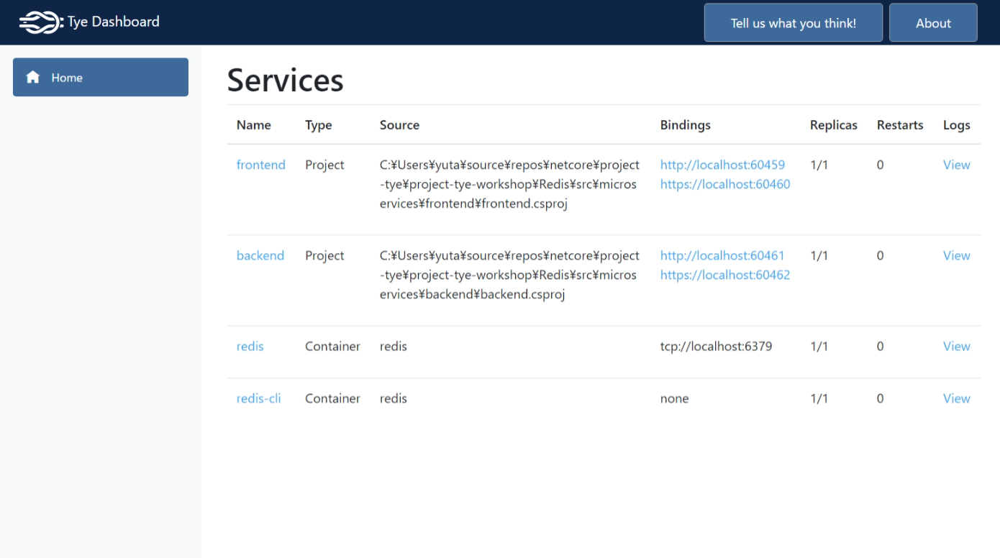

# Redisをアプリケーションに追加しよう

[YAML tutorial](../YAML/README.md) で作成したアプリケーションに Redis を追加して、アプリケーションと Redis をまとめてデプロイしてみましょう。

## `backend` を修正する

`backend/src/Controllers/WeatherForecastController.cs` に以下の変更を加えます。

### `Get` メソッドで分散キャッシュを使えるようにする

`using` を追加します。

```csharp
using Microsoft.Extensions.Caching.Distributed;
using System.Text.Json;
```

`Get` メソッドを以下のように変更します。

```csharp
[HttpGet]
public async Task<string> Get([FromServices]IDistributedCache cache)
{
    var weather = await cache.GetStringAsync("weather");

    if (weather == null)
    {
        var rng = new Random();
        var forecasts = Enumerable.Range(1, 5).Select(index => new WeatherForecast
        {
            Date = DateTime.Now.AddDays(index),
            TemperatureC = rng.Next(-20, 55),
            Summary = Summaries[rng.Next(Summaries.Length)]
        })
        .ToArray();

        weather = JsonSerializer.Serialize(forecasts);

        await cache.SetStringAsync("weather", weather, new DistributedCacheEntryOptions
        {
            AbsoluteExpirationRelativeToNow = TimeSpan.FromSeconds(5)
        });
    }
    return weather;
}
```

### 必要なパッケージを追加する

Redis を分散キャッシュストアとして使用するために必要な NuGet パッケージを追加します。  
`backend` フォルダで以下のコマンドを実行します。

```sh
dotnet add package Microsoft.Extensions.Caching.StackExchangeRedis
```

### Redis を分散キャッシュストアとして構成する

`Startup.cs` の `ConfigureServices` メソッドを以下のように変更します。

```csharp
public void ConfigureServices(IServiceCollection services)
{
    services.AddControllers();

    // ここから追加
    services.AddStackExchangeRedisCache(o =>
    {
         o.Configuration = Configuration.GetConnectionString("redis");
    });
    // ここまで追加
}
```

### `tye.yaml` の構成を変更する

`tye.yaml` を以下のように変更し、 Redis を依存関係に追加します。

```yaml
name: microservices
registry: tsubakimoto
services:
- name: frontend
  project: frontend/frontend.csproj
- name: backend
  project: backend/backend.csproj
- name: redis
  image: redis
  bindings:
  - port: 6379
    connectionString: "${host}:${port}" 
- name: redis-cli
  image: redis
  args: "redis-cli -h redis MONITOR"
```

### 実行してみる

`tye run` を実行し、アプリケーションの動作確認を行います。  
ダッシュボードに Redis が追加されたことが分かります。



`frontend` を短時間にリロードすると Redis にキャッシュされたデータを返すことを確認してみましょう。

## Kubernetes にデプロイする

Kubernetes 環境に対して Redis を含めた構成でデプロイしてみましょう。  
Kubernetes は [Deploy tutorial](../Deploy/README.md) で構成したものを使いましょう。

```sh
kubectl apply -f https://raw.githubusercontent.com/dotnet/tye/main/docs/tutorials/hello-tye/redis.yaml
kubectl get deployments
tye deploy --interactive
```

※デプロイ中に Redis の接続文字列の入力を求められた場合は `redis:6379` と入力しましょう。
