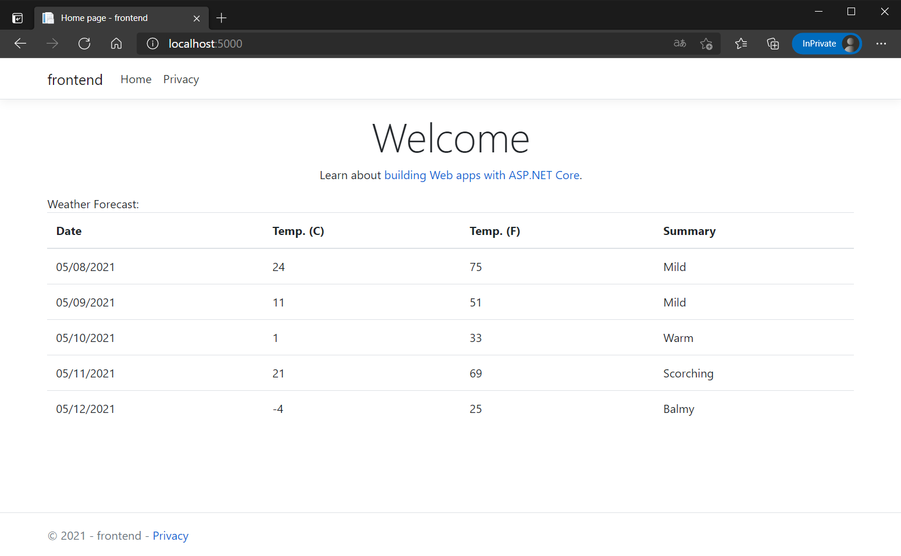

# Tye の構成管理ファイルを使ってみよう

Tye は `tye.yaml` というファイルで構成を管理することができます。  
[Basic](../Basic/README.md) で作成したサンプルアプリケーションを `tye.yaml` で構成管理してみましょう。

## `tye.yaml` の作成

`microservices` フォルダにて、下記のコマンドで `tye.yaml` を作成します。

```
tye init
```

`tye.yaml` が下記の内容で作成されたことを確認しましょう。  
ソリューションファイルに含まれるプロジェクトから `tye.yaml` が作成されました。

```yaml
# tye application configuration file
# read all about it at https://github.com/dotnet/tye
#
# when you've given us a try, we'd love to know what you think:
#    https://aka.ms/AA7q20u
#
name: microservices
services:
- name: frontend
  project: frontend/frontend.csproj
- name: backend
  project: backend/backend.csproj
```

## 構成管理ファイルを使ったデプロイ

[Deploy](../Deploy/README.md) では `tye.yaml` を使わず、コマンドラインでデプロイ構成を設定していきました。  
`tye.yaml` を使えばその内容に沿った構成でデプロイされます。

Visual Studio Code で `tye.yaml` を開き、コンテナーレジストリを追記します。

```yaml
name: microservices
registry: tsubakimoto # 自分の DockerHub を指定する
services:
- name: frontend
  project: frontend/frontend.csproj
- name: backend
  project: backend/backend.csproj
```

サンプルアプリケーションをデプロイしてみましょう。

```
tye deploy
kubectl port-forward svc/frontend 5000:80
```



## `tye.yaml` のスキーマを学ぶ

`tye.yaml` のスキーマについては以下を参考にしましょう。  
- [tye/schema.md at main · dotnet/tye](https://github.com/dotnet/tye/blob/main/docs/reference/schema.md)
- [Tyeの構成ファイルの tye.yaml のスキーマ定義を見てみる - つばろぐ](https://tsubalog.hatenablog.com/entry/2020/09/06/090000)
